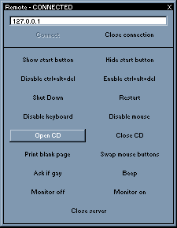



## Undetectable remote admin tool

### Description

a basic client server type remote admin tool. the client end of it is basic with very simple options the great part is the server because once it is run it copys itself to the windows directory and creates a registry key to start with windows, it is also hidden from the ctrl+alt+del Menu. It is a simple example of a client server admin tool that you can add your own features to. below is a screenshot of the client. (i have the client named "Master" and the server named "Slave")
 
### More Info
 

             |
---                |---
**Submitted On**   |2001-07-19 00:39:58
**By**             |[Nerd](https://github.com/Planet-Source-Code/PSCIndex/blob/master/ByAuthor/nerd.md)
**Level**          |Intermediate
**User Rating**    |3.9 (39 globes from 10 users)
**Compatibility**  |VB 6\.0
**Category**       |[Complete Applications](https://github.com/Planet-Source-Code/PSCIndex/blob/master/ByCategory/complete-applications__1-27.md)
**World**          |[Visual Basic](https://github.com/Planet-Source-Code/PSCIndex/blob/master/ByWorld/visual-basic.md)
**Archive File**   |[Undetectab236197272001\.zip](https://github.com/Planet-Source-Code/nerd-undetectable-remote-admin-tool__1-25572/archive/master.zip)

